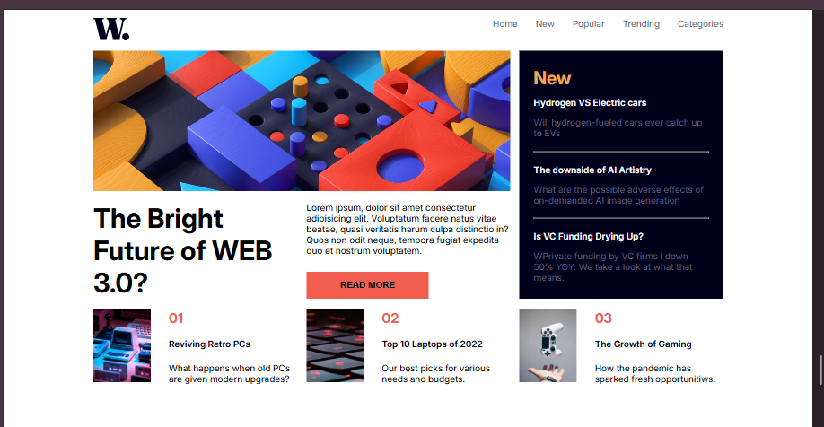

# Frontend Mentor - News homepage solution

This is a solution to the [News homepage challenge on Frontend Mentor](https://www.frontendmentor.io/challenges/news-homepage-H6SWTa1MFl). Frontend Mentor challenges help you improve your coding skills by building realistic projects. 

## Table of contents

- [Overview](#overview)
  - [The challenge](#the-challenge)
  - [Screenshot](#screenshot)
  - [Links](#links)
- [My process](#my-process)
  - [Built with](#built-with)
  - [What I learned](#what-i-learned)
  - [Continued development](#continued-development)
  - [Useful resources](#useful-resources)
- [Author](#author)
- [Acknowledgments](#acknowledgments)

## Overview

### The challenge

Users should be able to:

- View the optimal layout for the interface depending on their device's screen size
- See hover and focus states for all interactive elements on the page

### Screenshot

1440px laptop view:

Asus ZenBook fold view:

iPhone 14 pro max view:

Surface Pro 7 view:

### Links

- Solution URL: [[https://github.com/YourUsername/news-homepage](https://github.com/YourUsername/news-homepage)](https://github.com/Emin-062/frontendMentorByEmin.git)
- Live Site URL: [[https://your-live-site-url.com](https://emin-062.github.io/frontendMentorByEmin/)]([https://your-live-site-url.com](https://emin-062.github.io/frontendMentorByEmin/))

## My process

### Built with

- Semantic HTML5 markup  
- CSS custom properties  
- Flexbox  
- CSS Grid  
- Mobile-first workflow  
- JavaScript for interactive menu toggling  

### What I learned

This project was a great opportunity to deepen my understanding of CSS Grid and Flexbox by experimenting with named grid areas and flexible layouts. Initially, I combined Flexbox and Grid in the `.hero` section, but later refined it to rely solely on CSS Grid for cleaner and more maintainable code.

One of the biggest challenges I faced was managing the responsive navigation menu — especially handling the transition between mobile and desktop views seamlessly. I discovered how powerful `!important` can be in CSS to override styles quickly; however, I also realized its potential pitfalls. Through careful debugging and logical use of JavaScript event listeners and window resize handlers, I crafted a solution that keeps the menu behavior intuitive without forcing page reloads.

I also improved my skills in managing media queries to create a smooth, mobile-first responsive experience, ensuring that the site looks great and functions perfectly on all screen sizes.

Finally, I gained hands-on experience with accessible navigation practices and semantic HTML, making sure interactive elements have clear hover and focus states to enhance usability.

### Continued development

Moving forward, I want to:

- Continue refining my CSS Grid and Flexbox expertise, aiming for even more elegant and efficient layouts.  
- Explore advanced JavaScript techniques to enhance interactivity without sacrificing performance.  
- Learn more about accessibility standards to build inclusive web experiences.  
- Improve image optimization and adopt modern HTML5 elements like `<picture>` for responsive images.

### Useful resources

- [Frontend Mentor](https://www.frontendmentor.io/) – For real-world coding challenges and community support.  
- [CSS-Tricks Complete Guide to Grid](https://css-tricks.com/snippets/css/complete-guide-grid/) – Helped me master CSS Grid.  
- [MDN Web Docs](https://developer.mozilla.org/) – Comprehensive reference for web technologies.  

## Author
- Frontend Mentor - [@Emin-062](https://www.frontendmentor.io/profile/Emin-062)
- LinkedIn - [@Emin Naggayev](https://www.linkedin.com/in/emin-naggayev-39017a373/)  

## Acknowledgments

Special thanks to the Frontend Mentor community for inspiration and feedback.  
Grateful to all who share knowledge about CSS Grid, responsive design, and JavaScript best practices.
